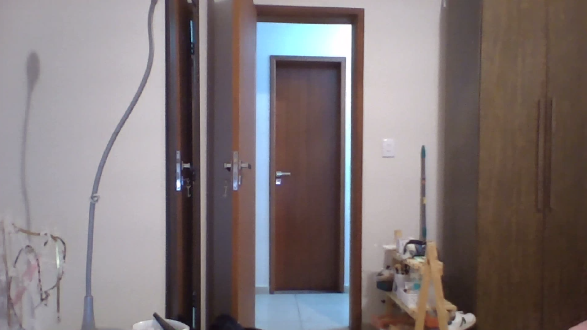
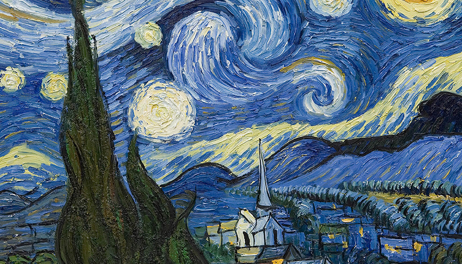
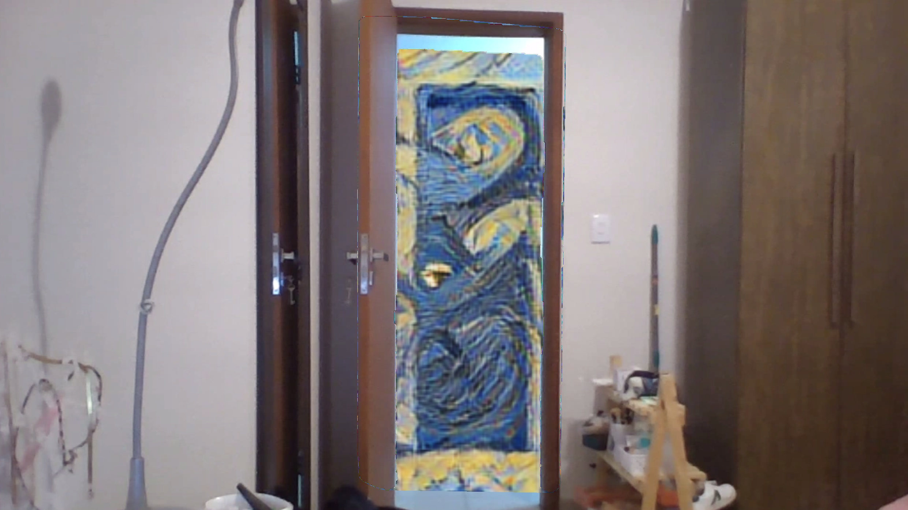

 
<h1 align = "center"> Trabalho Final - INF 492 </h1>

<h2 align = "center"> Transformando portas em portais: como detecção de objetos e transferência de estilo podem transformar imagens
 </h2>

  
  

  

## Índice

- [Resumo](#Resumo)
- [Metodologia](#Metodologia)
- [Resultados](#Resultados)
- [Conclusão](#Conclusão)
- [Referências](#Referências)
- [Responsáveis](#Responsáveis)

## Resumo
&emsp;&emsp;Projeto final apresentado à disciplina de Introdução a Visão Computacional e Redes Convolucionais, de código INF 492, ministrada pelo professor Michel S. Melo, como requisito parcial para aprovação na disciplina. Este trabalho tem como objetivo combinar quadros clássicos e contemporâneos com o mundo externo, mudando o interior de uma porta para o estilo em fotos e/ou filmagens em tempo real. Para isso foram usadas diversas técnicas de Inteligência Artificial e Visão Computacional, focadas principalmente em redes neurais convolucionais (CNNs) com
treinamento supervisionado. Foram utilizados modelos propostos para problemas de segmentação semântica na detecção de portas e transferência de estilo para estilização da imagem de entrada.
 
## Metodologia
&emsp;&emsp; Para detecção de portas, utilizamos um modelo pré-treinado, a YOLO. Para obter resultados mais precisos ao modificar o interior da porta, adotamos a abordagem de segmentação semântica utilizando o YOLOv8. Retreinamos a rede utilizando o conjunto de dados [DeepDoors 2](https://github.com/gasparramoa/DeepDoors2). As labels no formato YOLO podem ser encontradas para download nesse [link](https://drive.google.com/drive/folders/11SRtS36G7H3PK0_CZ1WIn5ZEU3lJg1Ew?usp=sharing). 
 
&emsp;&emsp; Para realizar uma transferência de estilo, inicialmente adotamos uma abordagem que permitia a [transferência arbitrária](https://arxiv.org/abs/1705.06830) de estilo a partir de qualquer foto fornecida. Nosso objetivo principal era alcançar essa funcionalidade, onde a rede pré-treinada seria capaz de transferir o estilo de uma foto selecionada. No entanto, descobrimos que essa abordagem exigia um custo computacional considerável, consumindo cerca de 3GB de VRAM apenas para realizar a transferência de estilo. Dado que nossa intenção era executar a transferência em tempo real, tornou-se importante ter um processo local, uma vez que o Google Colab apresentava atrasos na exibição das fotos capturadas pela webcam, além do próprio código já exigir um tempo considerável para ser executado em tempo real.
 
&emsp;&emsp; A fim de contornar esse problema, optamos por utilizar [rede pré-treinada com 16 estilos específicos](https://github.com/ryanwongsa/Real-time-multi-style-transfer) para estilização de imagens. Essa abordagem reduziu significativamente o consumo de VRAM para 1.6GB e diminuiu consideravelmente o tempo de execução. Como resultado, conseguimos executar o processo localmente no computador pessoal de um dos membros do grupo.
 
&emsp;&emsp; Para integrar a técnica YOLO com a transferência de estilo, a fim de estilizar apenas a parte interna de uma porta, utilizamos a segmentação semântica fornecida pelo YOLO e extraímos a máscara correspondente à moldura da porta. Em seguida, por meio de funções em Python, transformamos essa máscara em um polígono convexo fechado. Em seguida, aplicamos o polígono convexo à imagem original, restringindo a estilização à região interna delimitada pela máscara da moldura da porta.

## Conclusão 
&emsp;&emsp; Através da utilização da [rede pré-treinada com 16 estilos específicos](https://github.com/ryanwongsa/Real-time-multi-style-transfer) , fomos capazes de realizar o processo completo de detecção de portas e estilização do interior em uma média de  0.3 segundos de tempo de execução. Essa implementação foi realizada em um computador equipado com uma placa gráfica NVIDIA RTX 3050Ti, o que proporcionou um desempenho otimizado para a tarefa.

## Referências
https://github.com/gasparramoa/DeepDoors2  
https://arxiv.org/abs/1705.06830  
https://github.com/ryanwongsa/Real-time-multi-style-transfer  

## Responsáveis
- [Luísa de Souza Ferreira](https://github.com/ferreiraluisa)
- [Ana Clara Osias](https://github.com/AnaClaraOsias)
- [Lucas Vieira](https://github.com/ls-Vieira)

